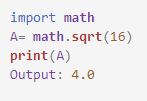
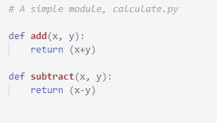
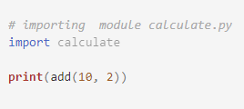
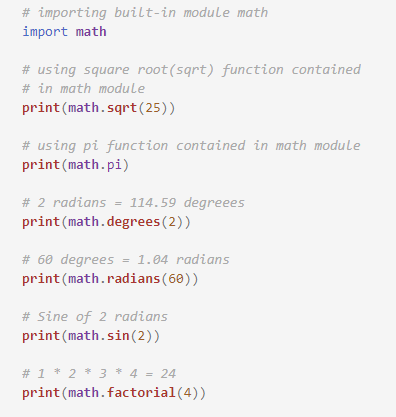

To perform specific functions like add, subtract, power, square root, we need to write two three lines of logic to make our task or function work properly. So we have built in functions inside those modules which can straight away perform those task by passing the values to calculate.
Here you will learn about some of the built-in modules used in Python programming language. 
 We simply have to import those built in modules present inside the program then we can easily perform those specific task after calling those functions.
Some of the modules that are used in Python are :
math, datetime, decimal, operator, test, user, sets, etc.
 
 
 
Output 
4.0 
 
The above given example is of math module. Here math module is imported, with the help of which, complex mathematical calculations can be performed.
 
<b>The import statement</b> 
We can use any Python source file as a module by executing an import statement in some other Python source file. 
When the interpreter encounters an import statement, it imports the module if the module is present in the search path. For example, to import the module calculate.py, we need to put the following command at the top of the script :  
Program  
 
 
Output  
12  
Program  
 
Output 
5.0 
3.141592653589793 
114.59155902616465 
1.0471975511965976 
0.9092974268256817 
24  

